# 🛰️ PolarTwin
### Real-Time Digital Twin for Remote Antarctic Station Management

> **Smart India Hackathon 2026 — SIH26060**  
> **Ministry of Earth Sciences (MoES) / National Centre for Polar and Ocean Research (NCPOR)**

**PolarTwin** is a Digital Twin platform designed to provide a unified remote-monitoring interface for India's Antarctic research stations — **Maitri** and **Bharati**.

It brings station telemetry, energy status, environmental conditions, infrastructure health, logistics and operational alerts into a single dashboard so that critical conditions can be detected and acted upon remotely.

---

## 🚀 Why PolarTwin?

Antarctic research stations operate in one of the world's most isolated and extreme environments.

Physical access is limited, resupply is periodic, and critical infrastructure such as power generation, heating, communication and water systems must remain operational throughout the Antarctic winter.

The central challenge is simple:

> **How can India continuously understand the condition of a remote Antarctic station without physically being there?**

PolarTwin addresses this through a **Digital Twin + IoT telemetry + satellite communication + intelligent alerting** architecture.

---

# 🎯 Problem Statement

### SIH26060 — Digital Platform for Efficient Remote Management of Indian Antarctic Research Stations

India operates two major Antarctic research stations:

- 🏔️ **Maitri** — Schirmacher Oasis
- 🌊 **Bharati** — Larsemann Hills

The stations require continuous monitoring of:

- ⚡ Energy & power systems
- 🌡️ Environmental conditions
- 🔧 Infrastructure & equipment
- 📦 Critical supplies & logistics
- 🚨 Operational risks

PolarTwin aims to convert these physical station conditions into a **live digital representation** accessible from India.

---

# 💡 Our Solution

PolarTwin follows a simple operational concept:

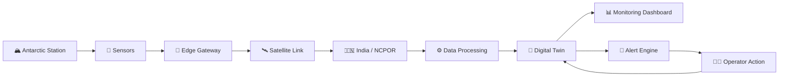

### The platform provides:

- Real-time-style station monitoring
- Station-specific telemetry
- Energy monitoring
- Environmental monitoring
- Infrastructure health tracking
- Logistics & supply monitoring
- Threshold-based alerts
- Historical telemetry visualization
- Offline-first data buffering concept
- Future predictive-maintenance integration

---

# 🧬 What is the PolarTwin Digital Twin?

The Digital Twin represents the operational state of an Antarctic station inside a virtual environment.

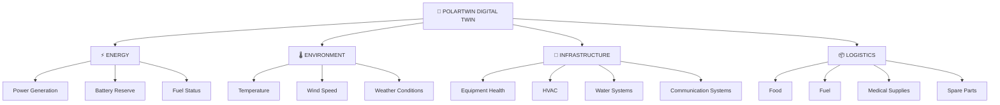

This allows operators to move from **isolated sensor readings** to a unified operational picture.

---

# 🛰️ System Architecture

The proposed production architecture connects sensors deployed at the station with the monitoring dashboard in India.

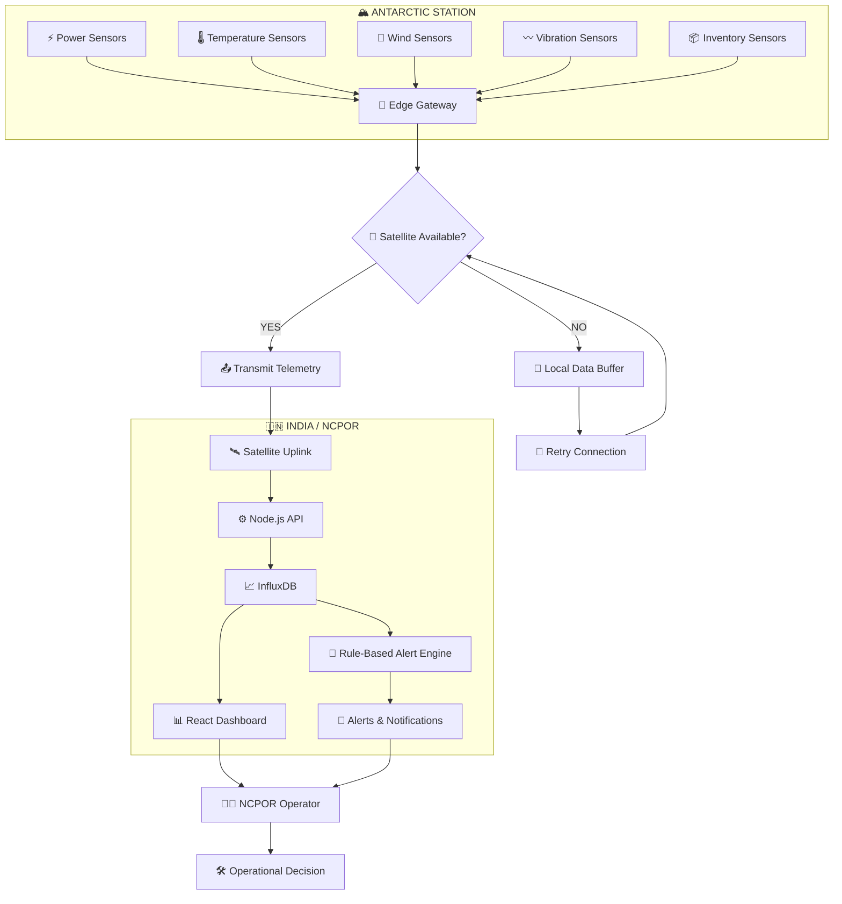

---

# 🔄 End-to-End Data Flow

The complete telemetry journey can be understood as:

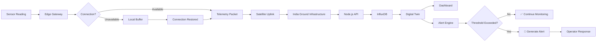

---

# 📊 Dashboard Modules

PolarTwin's dashboard is organized around four major operational domains.

---

## ⚡ 1. Energy Monitoring

The Energy module provides visibility into the station's power ecosystem.

### Monitored parameters

- Power generation
- Power consumption
- Battery reserve
- Generator condition
- Fuel availability
- Energy trends

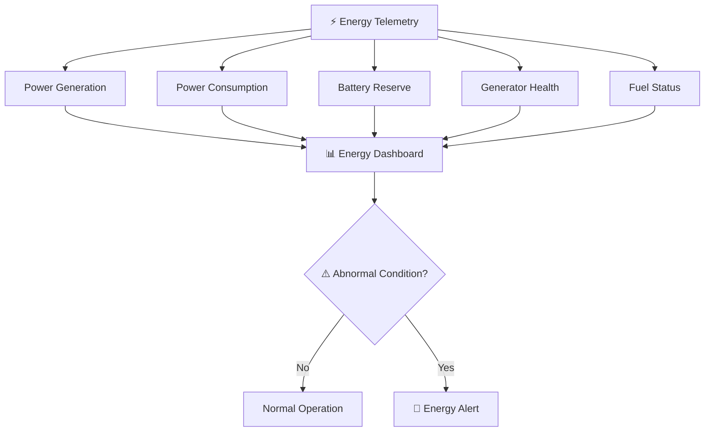

---

# 🌡️ 2. Environment Monitoring

Environmental conditions directly influence station operations.

### Parameters

- Temperature
- Wind speed
- Weather conditions
- Environmental trends
- Station-specific thresholds

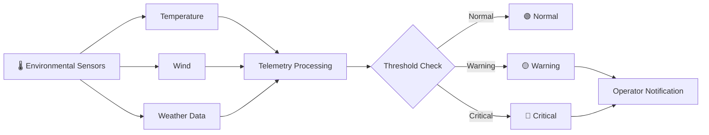

---

# 🔧 3. Infrastructure Health

The Infrastructure module focuses on critical station equipment.

### Example systems

- HVAC / thermal control
- Water treatment
- Communication systems
- Generator systems
- Structural monitoring

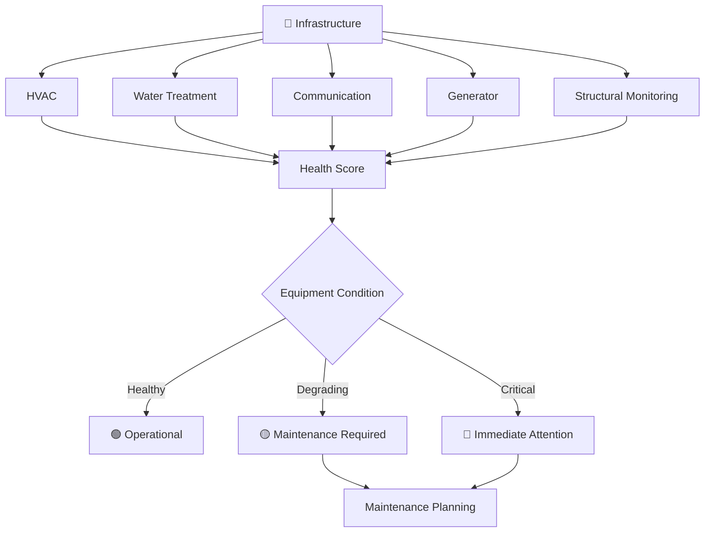

---

# 📦 4. Logistics & Supply Monitoring

Because Antarctic resupply is highly constrained, resource visibility is critical.

PolarTwin tracks:

- 🛢️ Diesel fuel
- 🍱 Food reserves
- 💊 Medical supplies
- 🔩 Spare parts
- 📈 Consumption trends
- ⏳ Estimated remaining availability

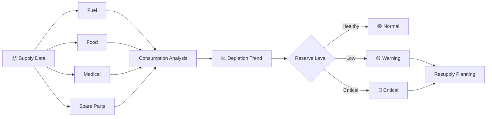

---

# 🚨 Intelligent Alert Engine

PolarTwin uses a threshold-based alert mechanism in the current prototype.

The system evaluates incoming telemetry and determines whether an operational condition requires attention.

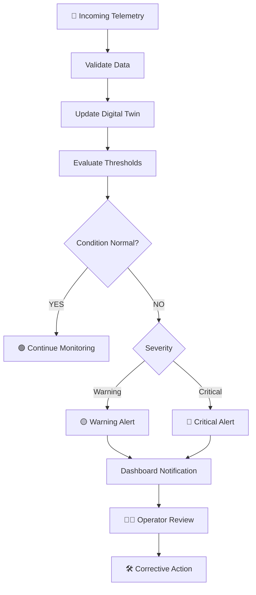

### Current alert categories

- 🔋 Low battery
- 💨 High wind
- 🥶 Extreme temperature
- 🔧 Equipment health degradation
- 🚨 Critical equipment condition
- 📦 Low supply reserve

---

# 💾 Offline-First Data Pipeline

One of PolarTwin's key production concepts is **local buffering during communication outages**.

Instead of immediately discarding telemetry when the satellite connection is unavailable, the edge gateway can temporarily store timestamped readings.

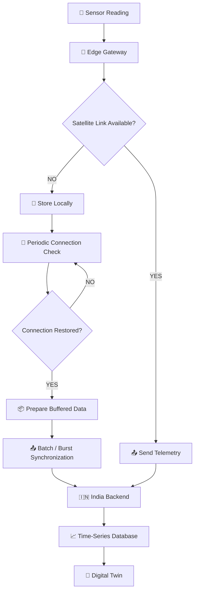

### Why this matters

The objective is to prevent communication interruptions from becoming permanent telemetry gaps.

> **Store locally → reconnect → synchronize → restore the timeline**

---

# 🧠 Station-Specific Intelligence

Maitri and Bharati do not have identical operational environments.

Therefore, PolarTwin is designed around **station-specific monitoring rules**.

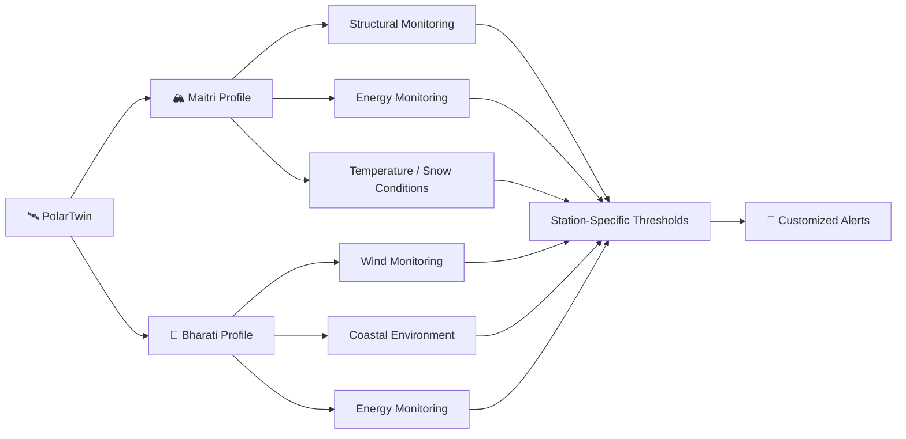

This makes the platform adaptable rather than treating both stations as identical environments.

---

# 🖥️ Current Prototype

The current implementation is a **React-based working dashboard prototype**.

### Implemented

- ✅ React 18 dashboard
- ✅ Maitri / Bharati station switching
- ✅ Energy monitoring interface
- ✅ Environment monitoring interface
- ✅ Infrastructure health interface
- ✅ Logistics monitoring interface
- ✅ Dynamic telemetry simulation
- ✅ Threshold-based alert system
- ✅ Warning / Critical alert states
- ✅ Interactive charts using Recharts
- ✅ Responsive dashboard UI
- ✅ Lucide-based interface icons

### Demo Data

The current dashboard uses **simulated telemetry** to demonstrate how live station data would behave.

> ⚠️ **Important:** The displayed telemetry is demo/simulated data and does not represent live Antarctic measurements.

---

# 🏗️ Current vs Production Architecture

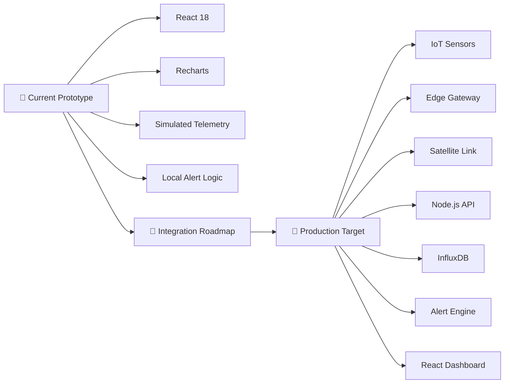

This distinction is intentional:

**The prototype demonstrates the user experience and monitoring logic, while the production architecture defines how real station telemetry can eventually be integrated.**

---

# 🗂️ Project Structure

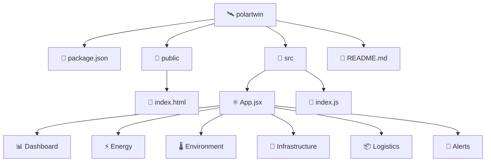

### Simplified structure

```text
polartwin/
│
├── package.json
│
├── public/
│   └── index.html
│
├── src/
│   ├── App.jsx
│   └── index.js
│
└── README.md
```

---

# 🛠️ Technology Stack

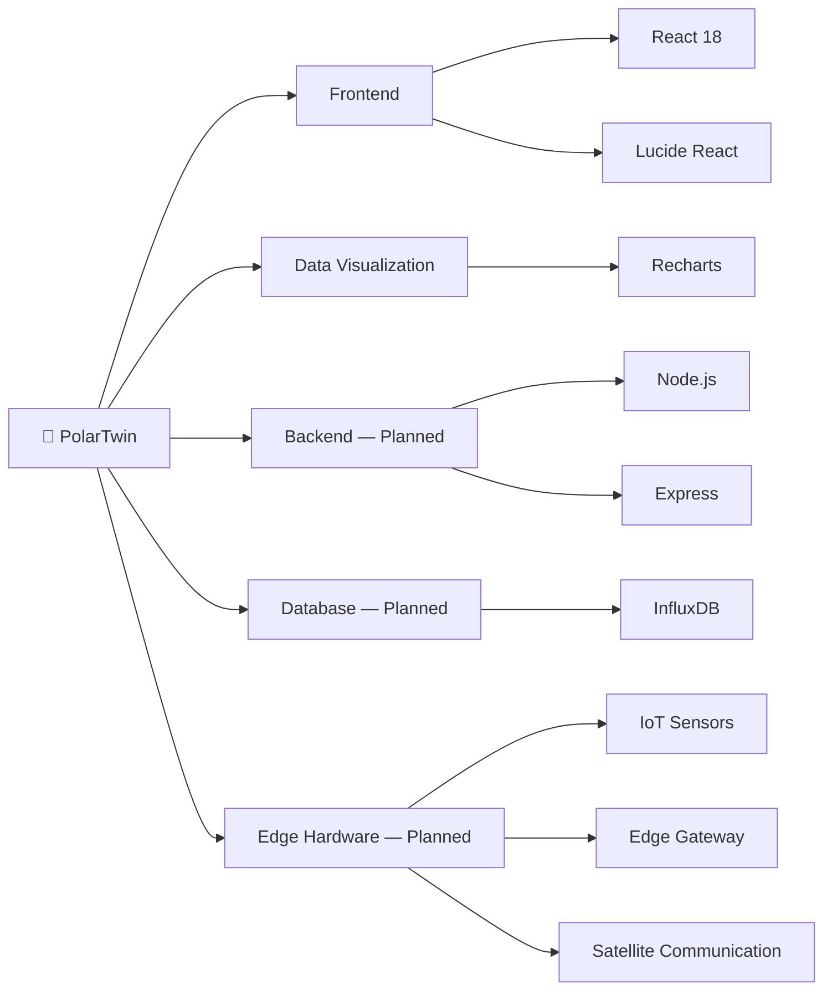

| Technology | Role |
|---|---|
| **React 18** | Dashboard interface |
| **Recharts** | Telemetry visualization |
| **Lucide React** | UI icons |
| **Node.js + Express** | Planned telemetry API |
| **InfluxDB** | Planned time-series storage |
| **IoT Sensors** | Planned station telemetry |
| **Edge Gateway** | Planned local processing & buffering |
| **Satellite Link** | Planned remote telemetry transmission |

---

# 🔄 Development Roadmap

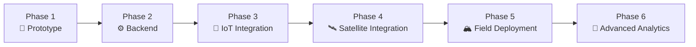

### Phase 1 — Prototype
- React dashboard
- Simulated telemetry
- Charts
- Alert logic
- Station switching

### Phase 2 — Backend Integration
- Node.js / Express API
- Authentication
- Telemetry ingestion
- InfluxDB storage

### Phase 3 — Hardware Integration
- IoT sensor network
- Edge gateway
- Local data buffering
- Sensor health monitoring

### Phase 4 — Communication Integration
- Satellite telemetry
- Low-bandwidth payload optimization
- Automatic synchronization

### Phase 5 — Field Deployment
- Ruggedized hardware
- Environmental testing
- Station integration
- Operational validation

### Phase 6 — Advanced Analytics
- Historical anomaly detection
- Predictive maintenance
- Resource forecasting
- Advanced operational intelligence

---

# 🔮 Future Vision

PolarTwin is designed to evolve from a monitoring dashboard into a complete remote station-management platform.

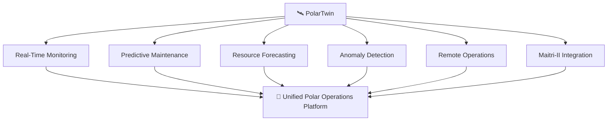

The long-term vision is to create a reusable digital infrastructure layer that can support both existing stations and future generations of Antarctic research infrastructure.

---

# 💻 Installation & Local Setup

## 1. Prerequisites

Install:

- Node.js v18+
- npm

Verify:

```bash
node -v
npm -v
```

---

## 2. Clone Repository

```bash
git clone https://github.com/kailashramawat223-dot/POLARTWIN.git
```

```bash
cd POLARTWIN
```

---

## 3. Install Dependencies

```bash
npm install
```

---

## 4. Start the Dashboard

```bash
npm start
```

Open:

```text
http://localhost:3000
```

---

# 🎯 Expected Workflow

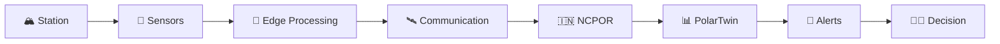

**Monitor → Detect → Alert → Decide → Act**

---

# 🌍 Impact

PolarTwin aims to improve Antarctic station operations through:

### 🛡️ Safety
Earlier visibility into hazardous environmental and equipment conditions.

### ⚡ Reliability
Continuous monitoring of critical energy and infrastructure systems.

### 📦 Logistics
Better understanding of resource consumption and resupply requirements.

### 🔬 Scientific Continuity
Reduced operational disruptions to scientific activities.

### 🇮🇳 Strategic Capability
A reusable digital monitoring framework for India's Antarctic infrastructure.

---

# 🇮🇳 Built for India's Polar Future

PolarTwin is designed around a simple principle:

> **The station may be thousands of kilometres away, but its operational state should never feel invisible.**

By combining **Digital Twin technology, telemetry, edge computing, satellite communication and intelligent alerting**, PolarTwin creates a foundation for smarter and safer remote Antarctic operations.

---

## 👨‍💻 Smart India Hackathon 2026

**Problem Statement:** SIH26060  
**Organization:** Ministry of Earth Sciences / NCPOR  
**Theme:** Smart Automation  
**Category:** Software  

### 🛰️ PolarTwin

**Monitor the station. Understand the risk. Act before failure.**

---

## 📚 References

- National Centre for Polar and Ocean Research (NCPOR)
- Ministry of Earth Sciences (MoES)
- Smart India Hackathon
- Government publications related to Indian Antarctic expeditions
- Digital Twin concepts and industrial monitoring architectures

---

## ⚠️ Prototype Disclaimer

PolarTwin is currently a **demonstration/prototype system**.

Telemetry displayed in the dashboard is simulated and is intended to demonstrate the proposed monitoring, visualization and alerting workflow.

Real-world deployment would require:

- Certified Antarctic-grade sensors
- Validated communication infrastructure
- Hardware environmental testing
- Secure backend infrastructure
- NCPOR integration
- Field validation
- Operational safety certification
